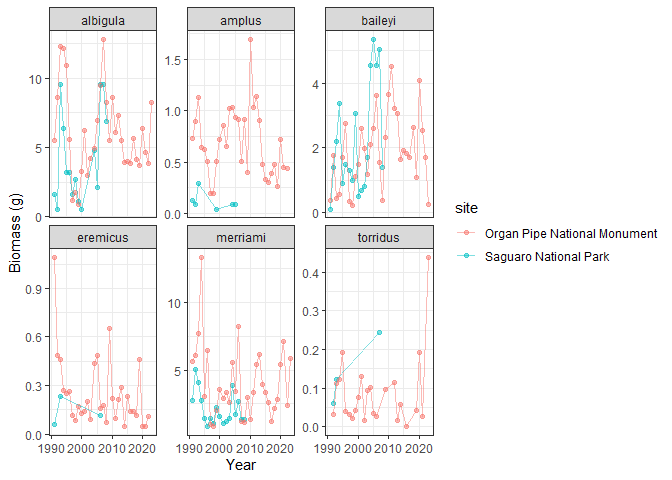
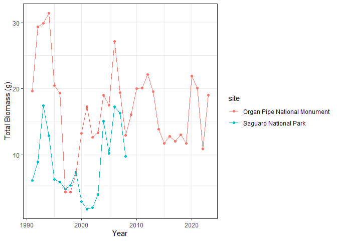
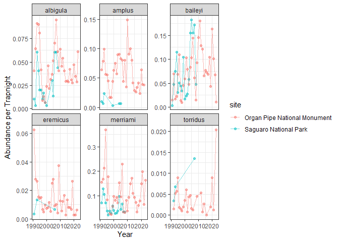

data_comparison
================
Hannah Dempsey

# Comparing Field Site Statistics

Set up:

``` r
#Week 3 (loading in packages and read_csv)

#install.packages("tidyverse")
library(tidyverse)
```

    ## ── Attaching core tidyverse packages ──────────────────────── tidyverse 2.0.0 ──
    ## ✔ dplyr     1.1.4     ✔ readr     2.1.5
    ## ✔ forcats   1.0.0     ✔ stringr   1.5.1
    ## ✔ ggplot2   3.5.1     ✔ tibble    3.2.1
    ## ✔ lubridate 1.9.4     ✔ tidyr     1.3.1
    ## ✔ purrr     1.0.4     
    ## ── Conflicts ────────────────────────────────────────── tidyverse_conflicts() ──
    ## ✖ dplyr::filter() masks stats::filter()
    ## ✖ dplyr::lag()    masks stats::lag()
    ## ℹ Use the conflicted package (<http://conflicted.r-lib.org/>) to force all conflicts to become errors

``` r
#creating function to plot ecological data facet wrapped by species
#Week 11 (creating functions)
ecol_per_species <- function(data, species_vector, y_axis, y_label) {
  graph <- data %>% 
    filter(species %in% species_vector) %>% 
    ggplot(., aes(x = year, y = {{y_axis}}, color = site)) +
    geom_point(alpha = 0.5) +
    geom_line(alpha = 0.5) +
    facet_wrap(~species, scales = "free_y") + 
    labs(y = y_label, x = "Year") +
    theme_bw()
  return(graph)
}
```

### Biomass Data

#### By species:

Adding site column to dataframes:

``` r
#Week 3 (read_csv), Week 4 (mutate), and Week 9 (file paths)
#loading in the data
saguaro_biomass <- read_csv("../data_clean/saguaro_biomass.csv")
```

    ## Rows: 80 Columns: 3
    ## ── Column specification ────────────────────────────────────────────────────────
    ## Delimiter: ","
    ## chr (1): species
    ## dbl (2): year, biomass_g
    ## 
    ## ℹ Use `spec()` to retrieve the full column specification for this data.
    ## ℹ Specify the column types or set `show_col_types = FALSE` to quiet this message.

``` r
orpi_biomass <- read_csv("../data_clean/orpi_biomass.csv")
```

    ## Rows: 290 Columns: 3
    ## ── Column specification ────────────────────────────────────────────────────────
    ## Delimiter: ","
    ## chr (1): species
    ## dbl (2): year, biomass_g
    ## 
    ## ℹ Use `spec()` to retrieve the full column specification for this data.
    ## ℹ Specify the column types or set `show_col_types = FALSE` to quiet this message.

``` r
#adding site column to each dataframe
saguaro_biomass <- saguaro_biomass %>% 
  mutate(site = "Saguaro National Park")
saguaro_biomass
```

    ## # A tibble: 80 × 4
    ##     year species      biomass_g site                 
    ##    <dbl> <chr>            <dbl> <chr>                
    ##  1  1991 albigula        1.59   Saguaro National Park
    ##  2  1991 amplus          0.125  Saguaro National Park
    ##  3  1991 baileyi         0.0991 Saguaro National Park
    ##  4  1991 eremicus        0.0577 Saguaro National Park
    ##  5  1991 merriami        2.78   Saguaro National Park
    ##  6  1991 penicillatus    1.47   Saguaro National Park
    ##  7  1992 albigula        0.531  Saguaro National Park
    ##  8  1992 amplus          0.0832 Saguaro National Park
    ##  9  1992 baileyi         1.39   Saguaro National Park
    ## 10  1992 merriami        5.02   Saguaro National Park
    ## # ℹ 70 more rows

``` r
orpi_biomass <- orpi_biomass %>% 
   mutate(site = "Organ Pipe National Monument")
orpi_biomass
```

    ## # A tibble: 290 × 4
    ##     year species      biomass_g site                        
    ##    <dbl> <chr>            <dbl> <chr>                       
    ##  1  1991 albigula        5.49   Organ Pipe National Monument
    ##  2  1991 amplus          0.728  Organ Pipe National Monument
    ##  3  1991 arizonae        0.254  Organ Pipe National Monument
    ##  4  1991 baileyi         0.365  Organ Pipe National Monument
    ##  5  1991 eremicus        1.09   Organ Pipe National Monument
    ##  6  1991 intermedius     0.0743 Organ Pipe National Monument
    ##  7  1991 merriami        5.62   Organ Pipe National Monument
    ##  8  1991 penicillatus    6.01   Organ Pipe National Monument
    ##  9  1992 albigula        8.62   Organ Pipe National Monument
    ## 10  1992 amplus          0.894  Organ Pipe National Monument
    ## # ℹ 280 more rows

Bind dataframes into one:

``` r
#Week 4 (bind_rows)
all_biomass <- bind_rows(saguaro_biomass, orpi_biomass)
all_biomass
```

    ## # A tibble: 370 × 4
    ##     year species      biomass_g site                 
    ##    <dbl> <chr>            <dbl> <chr>                
    ##  1  1991 albigula        1.59   Saguaro National Park
    ##  2  1991 amplus          0.125  Saguaro National Park
    ##  3  1991 baileyi         0.0991 Saguaro National Park
    ##  4  1991 eremicus        0.0577 Saguaro National Park
    ##  5  1991 merriami        2.78   Saguaro National Park
    ##  6  1991 penicillatus    1.47   Saguaro National Park
    ##  7  1992 albigula        0.531  Saguaro National Park
    ##  8  1992 amplus          0.0832 Saguaro National Park
    ##  9  1992 baileyi         1.39   Saguaro National Park
    ## 10  1992 merriami        5.02   Saguaro National Park
    ## # ℹ 360 more rows

Plotting annual biomass of each species:

``` r
#Week 2 (vectors)

#creating vector of species present in both sites
shared_species <- c("albigula", "amplus", "baileyi", "eremicus", "merriami", "pennicillatus", "torridus")

#plotting data
#Week 5 (data visualization)
ecol_per_species(all_biomass, shared_species, biomass_g, "Biomass (g)")
```

<!-- -->

``` r
ggsave("../figures/all_biomass.png")
```

    ## Saving 7 x 5 in image

#### By community:

Adding site column to all dataframes:

``` r
#Week 3 (read_csv), Week 4 (mutate), and Week 9 (file paths)

#loading in the data
saguaro_total_biomass <- read_csv("../data_clean/saguaro_total_biomass.csv")
```

    ## Rows: 18 Columns: 2
    ## ── Column specification ────────────────────────────────────────────────────────
    ## Delimiter: ","
    ## dbl (2): year, biomass_g
    ## 
    ## ℹ Use `spec()` to retrieve the full column specification for this data.
    ## ℹ Specify the column types or set `show_col_types = FALSE` to quiet this message.

``` r
orpi_total_biomass <- read_csv("../data_clean/orpi_total_biomass.csv")
```

    ## Rows: 33 Columns: 2
    ## ── Column specification ────────────────────────────────────────────────────────
    ## Delimiter: ","
    ## dbl (2): year, biomass_g
    ## 
    ## ℹ Use `spec()` to retrieve the full column specification for this data.
    ## ℹ Specify the column types or set `show_col_types = FALSE` to quiet this message.

``` r
#adding site column to each dataframe
saguaro_total_biomass <- saguaro_total_biomass %>% 
  mutate(site = "Saguaro National Park")
saguaro_total_biomass
```

    ## # A tibble: 18 × 3
    ##     year biomass_g site                 
    ##    <dbl>     <dbl> <chr>                
    ##  1  1991      6.12 Saguaro National Park
    ##  2  1992      8.94 Saguaro National Park
    ##  3  1993     17.4  Saguaro National Park
    ##  4  1994     12.9  Saguaro National Park
    ##  5  1995      6.30 Saguaro National Park
    ##  6  1996      5.85 Saguaro National Park
    ##  7  1997      4.85 Saguaro National Park
    ##  8  1998      5.34 Saguaro National Park
    ##  9  1999      7.38 Saguaro National Park
    ## 10  2000      2.93 Saguaro National Park
    ## 11  2001      1.82 Saguaro National Park
    ## 12  2002      1.98 Saguaro National Park
    ## 13  2003      3.97 Saguaro National Park
    ## 14  2004     15.1  Saguaro National Park
    ## 15  2005     10.2  Saguaro National Park
    ## 16  2006     17.3  Saguaro National Park
    ## 17  2007     16.3  Saguaro National Park
    ## 18  2008      9.74 Saguaro National Park

``` r
orpi_total_biomass <- orpi_total_biomass %>% 
   mutate(site = "Organ Pipe National Monument")
orpi_total_biomass
```

    ## # A tibble: 33 × 3
    ##     year biomass_g site                        
    ##    <dbl>     <dbl> <chr>                       
    ##  1  1991     19.6  Organ Pipe National Monument
    ##  2  1992     29.4  Organ Pipe National Monument
    ##  3  1993     29.9  Organ Pipe National Monument
    ##  4  1994     31.4  Organ Pipe National Monument
    ##  5  1995     20.5  Organ Pipe National Monument
    ##  6  1996     19.3  Organ Pipe National Monument
    ##  7  1997      4.33 Organ Pipe National Monument
    ##  8  1998      4.40 Organ Pipe National Monument
    ##  9  1999      7.09 Organ Pipe National Monument
    ## 10  2000     13.2  Organ Pipe National Monument
    ## # ℹ 23 more rows

Bind dataframes into one:

``` r
#Week 4 (bind_rows)

all_total_biomass <- bind_rows(saguaro_total_biomass, orpi_total_biomass)
all_total_biomass
```

    ## # A tibble: 51 × 3
    ##     year biomass_g site                 
    ##    <dbl>     <dbl> <chr>                
    ##  1  1991      6.12 Saguaro National Park
    ##  2  1992      8.94 Saguaro National Park
    ##  3  1993     17.4  Saguaro National Park
    ##  4  1994     12.9  Saguaro National Park
    ##  5  1995      6.30 Saguaro National Park
    ##  6  1996      5.85 Saguaro National Park
    ##  7  1997      4.85 Saguaro National Park
    ##  8  1998      5.34 Saguaro National Park
    ##  9  1999      7.38 Saguaro National Park
    ## 10  2000      2.93 Saguaro National Park
    ## # ℹ 41 more rows

Plotting community biomass:

``` r
#Week 5 (data visualization)

ggplot(all_total_biomass, aes(x = year, y = biomass_g, color = site)) +
  geom_point() +
  geom_line() +
  labs(y = "Total Biomass (g)", x = "Year") +
  theme_bw()
```

<!-- -->

``` r
ggsave("../figures/orpi_and_saguaro_biomass.png")
```

    ## Saving 7 x 5 in image

### Abundance Data

Loading in datasets:

``` r
#Week 3 (read_csv and select), Week 4 (mutate), and Week 9 (file paths)

saguaro_abund <- read_csv("../data_clean/saguaro_abund_trapnights.csv")
```

    ## Rows: 80 Columns: 6
    ## ── Column specification ────────────────────────────────────────────────────────
    ## Delimiter: ","
    ## chr (1): species
    ## dbl (5): year, abundance, nights, trap_nights, abund_per_trapnight
    ## 
    ## ℹ Use `spec()` to retrieve the full column specification for this data.
    ## ℹ Specify the column types or set `show_col_types = FALSE` to quiet this message.

``` r
orpi_abund <- read_csv("../data_clean/orpi_abund_trapnights.csv")
```

    ## Rows: 290 Columns: 5
    ## ── Column specification ────────────────────────────────────────────────────────
    ## Delimiter: ","
    ## chr (1): species
    ## dbl (4): year, abundance, trap_nights, abund_per_trapnight
    ## 
    ## ℹ Use `spec()` to retrieve the full column specification for this data.
    ## ℹ Specify the column types or set `show_col_types = FALSE` to quiet this message.

``` r
#removing superfluous columns
saguaro_abund <- saguaro_abund %>% 
  select(1, 2, 6)
saguaro_abund
```

    ## # A tibble: 80 × 3
    ##     year species      abund_per_trapnight
    ##    <dbl> <chr>                      <dbl>
    ##  1  1991 albigula                 0.0101 
    ##  2  1991 amplus                   0.0101 
    ##  3  1991 baileyi                  0.00338
    ##  4  1991 eremicus                 0.00338
    ##  5  1991 merriami                 0.0709 
    ##  6  1991 penicillatus             0.0777 
    ##  7  1992 albigula                 0.00338
    ##  8  1992 amplus                   0.00676
    ##  9  1992 baileyi                  0.0473 
    ## 10  1992 merriami                 0.128  
    ## # ℹ 70 more rows

``` r
orpi_abund <- orpi_abund %>% 
  select(1, 2, 5)
orpi_abund
```

    ## # A tibble: 290 × 3
    ##     year species      abund_per_trapnight
    ##    <dbl> <chr>                      <dbl>
    ##  1  1991 albigula                 0.0408 
    ##  2  1991 amplus                   0.0641 
    ##  3  1991 arizonae                 0.00292
    ##  4  1991 baileyi                  0.0146 
    ##  5  1991 eremicus                 0.0627 
    ##  6  1991 intermedius              0.00583
    ##  7  1991 merriami                 0.156  
    ##  8  1991 penicillatus             0.386  
    ##  9  1992 albigula                 0.0641 
    ## 10  1992 amplus                   0.0787 
    ## # ℹ 280 more rows

``` r
#adding site column to each dataframe
saguaro_abund <- saguaro_abund %>% 
  mutate(site = "Saguaro National Park")
saguaro_abund
```

    ## # A tibble: 80 × 4
    ##     year species      abund_per_trapnight site                 
    ##    <dbl> <chr>                      <dbl> <chr>                
    ##  1  1991 albigula                 0.0101  Saguaro National Park
    ##  2  1991 amplus                   0.0101  Saguaro National Park
    ##  3  1991 baileyi                  0.00338 Saguaro National Park
    ##  4  1991 eremicus                 0.00338 Saguaro National Park
    ##  5  1991 merriami                 0.0709  Saguaro National Park
    ##  6  1991 penicillatus             0.0777  Saguaro National Park
    ##  7  1992 albigula                 0.00338 Saguaro National Park
    ##  8  1992 amplus                   0.00676 Saguaro National Park
    ##  9  1992 baileyi                  0.0473  Saguaro National Park
    ## 10  1992 merriami                 0.128   Saguaro National Park
    ## # ℹ 70 more rows

``` r
orpi_abund <- orpi_abund %>% 
   mutate(site = "Organ Pipe National Monument")
orpi_abund
```

    ## # A tibble: 290 × 4
    ##     year species      abund_per_trapnight site                        
    ##    <dbl> <chr>                      <dbl> <chr>                       
    ##  1  1991 albigula                 0.0408  Organ Pipe National Monument
    ##  2  1991 amplus                   0.0641  Organ Pipe National Monument
    ##  3  1991 arizonae                 0.00292 Organ Pipe National Monument
    ##  4  1991 baileyi                  0.0146  Organ Pipe National Monument
    ##  5  1991 eremicus                 0.0627  Organ Pipe National Monument
    ##  6  1991 intermedius              0.00583 Organ Pipe National Monument
    ##  7  1991 merriami                 0.156   Organ Pipe National Monument
    ##  8  1991 penicillatus             0.386   Organ Pipe National Monument
    ##  9  1992 albigula                 0.0641  Organ Pipe National Monument
    ## 10  1992 amplus                   0.0787  Organ Pipe National Monument
    ## # ℹ 280 more rows

Bind dataframes into one

``` r
#Week 4 (bind_rows)

all_abund <- bind_rows(saguaro_abund, orpi_abund)
all_abund
```

    ## # A tibble: 370 × 4
    ##     year species      abund_per_trapnight site                 
    ##    <dbl> <chr>                      <dbl> <chr>                
    ##  1  1991 albigula                 0.0101  Saguaro National Park
    ##  2  1991 amplus                   0.0101  Saguaro National Park
    ##  3  1991 baileyi                  0.00338 Saguaro National Park
    ##  4  1991 eremicus                 0.00338 Saguaro National Park
    ##  5  1991 merriami                 0.0709  Saguaro National Park
    ##  6  1991 penicillatus             0.0777  Saguaro National Park
    ##  7  1992 albigula                 0.00338 Saguaro National Park
    ##  8  1992 amplus                   0.00676 Saguaro National Park
    ##  9  1992 baileyi                  0.0473  Saguaro National Park
    ## 10  1992 merriami                 0.128   Saguaro National Park
    ## # ℹ 360 more rows

Plotting abundance of each species:

``` r
#Week 5 (data visualization)

ecol_per_species(all_abund, shared_species, abund_per_trapnight, "Abundance per Trapnight")
```

<!-- -->

``` r
ggsave("../figures/all_abund.png")
```

    ## Saving 7 x 5 in image
