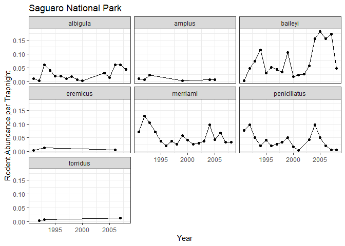
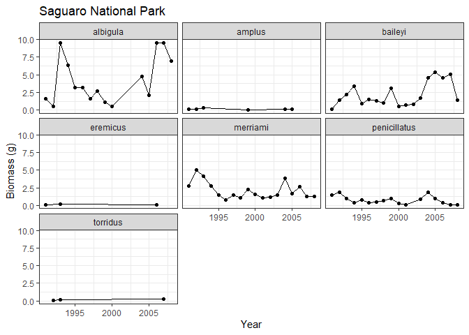
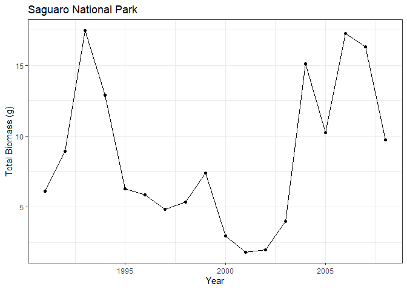

saguaro_analysis
================
Hannah Dempsey

# Saguaro National Park Analysis

Set up:

``` r
#Week 3 (loading in packages and read_csv), and Week 9 (file paths)

#install.packages("tidyverse")
library(tidyverse)
```

    ## ── Attaching core tidyverse packages ──────────────────────── tidyverse 2.0.0 ──
    ## ✔ dplyr     1.1.4     ✔ readr     2.1.5
    ## ✔ forcats   1.0.0     ✔ stringr   1.5.1
    ## ✔ ggplot2   3.5.1     ✔ tibble    3.2.1
    ## ✔ lubridate 1.9.4     ✔ tidyr     1.3.1
    ## ✔ purrr     1.0.4     
    ## ── Conflicts ────────────────────────────────────────── tidyverse_conflicts() ──
    ## ✖ dplyr::filter() masks stats::filter()
    ## ✖ dplyr::lag()    masks stats::lag()
    ## ℹ Use the conflicted package (<http://conflicted.r-lib.org/>) to force all conflicts to become errors

``` r
saguaro_clean <- read_csv("../data_clean/saguaro_clean.csv")
```

    ## Rows: 1212 Columns: 16
    ## ── Column specification ────────────────────────────────────────────────────────
    ## Delimiter: ","
    ## chr  (8): genus, species, recapture, sex, age, reprod_cond, web_trap_number,...
    ## dbl  (7): year, month, day, mass_g, rhf, body, tail
    ## date (1): trap_check_date
    ## 
    ## ℹ Use `spec()` to retrieve the full column specification for this data.
    ## ℹ Specify the column types or set `show_col_types = FALSE` to quiet this message.

### Abundance Data

Summarize the data by year:

``` r
#Week 4 (mutate, pipes, group_by, summarize)

survey_nights <- saguaro_clean %>% 
  group_by(year) %>% 
  distinct(trap_check_date) %>% 
  summarize(nights = n())
survey_nights
```

    ## # A tibble: 18 × 2
    ##     year nights
    ##    <dbl>  <int>
    ##  1  1991      2
    ##  2  1992      2
    ##  3  1993      2
    ##  4  1994      2
    ##  5  1995      2
    ##  6  1996      2
    ##  7  1997      2
    ##  8  1998      2
    ##  9  1999      2
    ## 10  2000      2
    ## 11  2001      2
    ## 12  2002      2
    ## 13  2003      2
    ## 14  2004      2
    ## 15  2005      2
    ## 16  2006      1
    ## 17  2007      2
    ## 18  2008      2

Calculate the annual abundance for each species per trapnight:

``` r
#Week 4 (mutate, pipes, group_by, summarize, and joins) and Week 9 (write_csv)

#148 traps used per night
rodents_per_trapnight <- saguaro_clean %>% 
  filter(recapture == "N") %>% 
  group_by(year, species) %>% 
  summarize(abundance = n()) %>% 
  left_join(survey_nights) %>% 
  mutate(trap_nights = nights * 148,
         abund_per_trapnight = abundance / trap_nights)
```

    ## `summarise()` has grouped output by 'year'. You can override using the
    ## `.groups` argument.
    ## Joining with `by = join_by(year)`

``` r
rodents_per_trapnight
```

    ## # A tibble: 80 × 6
    ## # Groups:   year [18]
    ##     year species      abundance nights trap_nights abund_per_trapnight
    ##    <dbl> <chr>            <int>  <int>       <dbl>               <dbl>
    ##  1  1991 albigula             3      2         296             0.0101 
    ##  2  1991 amplus               3      2         296             0.0101 
    ##  3  1991 baileyi              1      2         296             0.00338
    ##  4  1991 eremicus             1      2         296             0.00338
    ##  5  1991 merriami            21      2         296             0.0709 
    ##  6  1991 penicillatus        23      2         296             0.0777 
    ##  7  1992 albigula             1      2         296             0.00338
    ##  8  1992 amplus               2      2         296             0.00676
    ##  9  1992 baileyi             14      2         296             0.0473 
    ## 10  1992 merriami            38      2         296             0.128  
    ## # ℹ 70 more rows

``` r
#save dataframe for comparison
write_csv(rodents_per_trapnight, "../data_clean/saguaro_abund_trapnights.csv")
```

Plotting abundance per trapnight:

``` r
#Week 5 (data visualization)

saguaro_abundance <- ggplot(rodents_per_trapnight, aes(x = year, y = abund_per_trapnight)) +
  geom_point() +
  geom_line() +
  facet_wrap(~ species) +
  labs(y = "Rodent Abundance per Trapnight", x = "Year", title = "Saguaro National Park") +
  theme_bw()
saguaro_abundance
```

<!-- -->

``` r
ggsave("../figures/saguaro_abundance.png")
```

    ## Saving 7 x 5 in image

### Biomass Data

Calculating average mass for each species:

``` r
#Week 4(pipes, group_by, and summarize)

rodent_mass <- saguaro_clean %>% 
  group_by(species) %>% 
  summarize(avg_mass_g = mean(mass_g, na.rm = TRUE))
rodent_mass
```

    ## # A tibble: 7 × 2
    ##   species      avg_mass_g
    ##   <chr>             <dbl>
    ## 1 albigula          157. 
    ## 2 amplus             12.3
    ## 3 baileyi            29.3
    ## 4 eremicus           17.1
    ## 5 merriami           39.1
    ## 6 penicillatus       18.9
    ## 7 torridus           18.1

Calculate annual biomass of each species:

``` r
#Week 4 (mutate, pipes, group_by, summarize, and joins) and Week 9 (write_csv)

biomass_annual <- rodents_per_trapnight %>% 
  inner_join(rodent_mass, join_by(species)) %>% 
  group_by(year, species) %>% 
  summarize(biomass_g = abund_per_trapnight * avg_mass_g)
```

    ## `summarise()` has grouped output by 'year'. You can override using the
    ## `.groups` argument.

``` r
biomass_annual
```

    ## # A tibble: 80 × 3
    ## # Groups:   year [18]
    ##     year species      biomass_g
    ##    <dbl> <chr>            <dbl>
    ##  1  1991 albigula        1.59  
    ##  2  1991 amplus          0.125 
    ##  3  1991 baileyi         0.0991
    ##  4  1991 eremicus        0.0577
    ##  5  1991 merriami        2.78  
    ##  6  1991 penicillatus    1.47  
    ##  7  1992 albigula        0.531 
    ##  8  1992 amplus          0.0832
    ##  9  1992 baileyi         1.39  
    ## 10  1992 merriami        5.02  
    ## # ℹ 70 more rows

``` r
#save dataframe for comparison
write_csv(biomass_annual, "../data_clean/saguaro_biomass.csv")
```

Plotting annual biomass of each species:

``` r
#Week 5 (data visualization)

saguaro_biomass <- ggplot(biomass_annual, aes(x = year, y = biomass_g)) +
  geom_point() +
  geom_line() +
  facet_wrap(~species) +
  labs(y = "Biomass (g)", x = "Year", title = "Saguaro National Park") +
  theme_bw()
saguaro_biomass
```

<!-- -->

``` r
ggsave("../figures/saguaro_biomass.png")
```

    ## Saving 7 x 5 in image

Calculating annual community biomass:

``` r
#Week 4 (pipes, group_by, and summarize) and Week 9 (write_csv)

total_biomass_annual <- biomass_annual %>% 
  group_by(year) %>% 
  summarize(biomass_g = sum(biomass_g))
total_biomass_annual
```

    ## # A tibble: 18 × 2
    ##     year biomass_g
    ##    <dbl>     <dbl>
    ##  1  1991      6.12
    ##  2  1992      8.94
    ##  3  1993     17.4 
    ##  4  1994     12.9 
    ##  5  1995      6.30
    ##  6  1996      5.85
    ##  7  1997      4.85
    ##  8  1998      5.34
    ##  9  1999      7.38
    ## 10  2000      2.93
    ## 11  2001      1.82
    ## 12  2002      1.98
    ## 13  2003      3.97
    ## 14  2004     15.1 
    ## 15  2005     10.2 
    ## 16  2006     17.3 
    ## 17  2007     16.3 
    ## 18  2008      9.74

``` r
#save dataframe for comparison
write_csv(total_biomass_annual, "../data_clean/saguaro_total_biomass.csv")
```

Plotting annual community biomass:

``` r
#Week 5 (data visualization)

saguaro_total_biomass <- ggplot(total_biomass_annual, aes(x = year, y = biomass_g)) +
  geom_point() +
  geom_line() +
  labs(y = "Total Biomass (g)", x = "Year", title = "Saguaro National Park") +
  theme_bw()
saguaro_total_biomass
```

<!-- -->

``` r
ggsave("../figures/saguaro_total_biomass.png")
```

    ## Saving 7 x 5 in image
